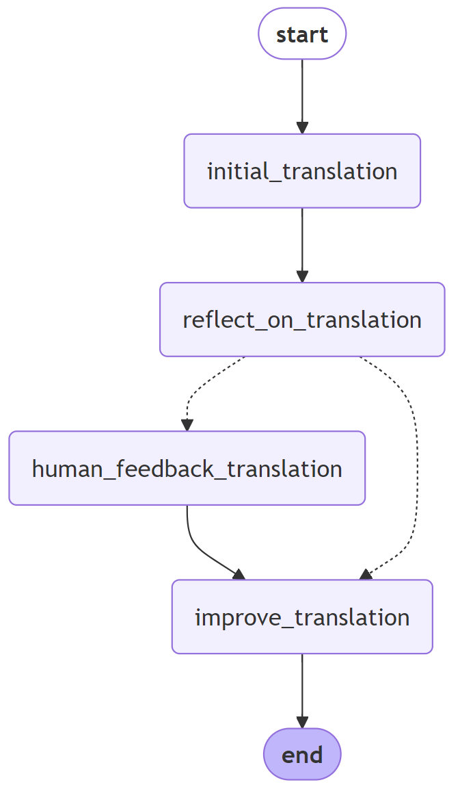
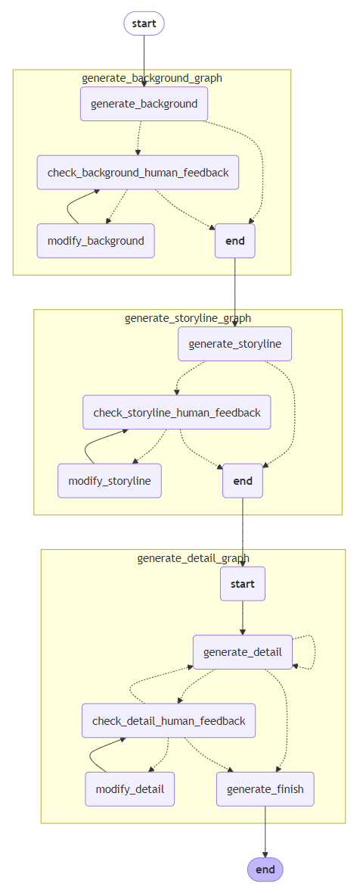
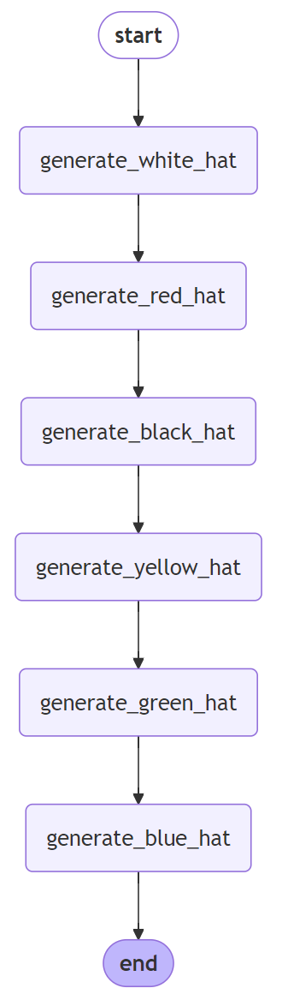

# chat-hopeflow-backend

ChatHopeFlow 的后端工程 
前端工程链接:[chat-hopeflow-frontend](https://github.com/IceHope/chat-hopeflow-frontend)

# 安装

pip install -r requirements.txt 

需要特别安装的软件

- redis 用于保存聊天记录

- milvus 向量数据库

# 代码架构

- controller
  保存FastAPI的各种接口,Websocket,post,get
  chat,knowledge,rag,agent

- dao
  
  - Sqlite 
    
    - user用户管理
    
    - knowledge 知识库管理
  
  - Redis
    聊天记录

- models
  
  工厂类:大语言模型,embedding模型,多模态模型,rerank模型

# 功能

- 聊天功能
  使用Langchain封装,Langfuse监控平台,username和sessionid区分不同对话,保存在redis中,支持多轮对话

- RAG
   基于Llamaindex的二次开发,模块化配置各个流程,RagBaseManager统一管理各个模块manager.
  
  - ReaderManager:加载文档
    HopeImageVisionLLMReader:自定义多模态问答reader,生成图片的描述
    
    - pdf的处理流程:
      
      - 提取出pdf的表格,图片
      
      - 清洗数据,去掉无实际意义的表格,图片
      
      - 针对每个表格,理应多模态大模型生成回复
      
      - 跟pdf的普通文档chunk,一起存在向量数据库中
      
      - 召回的时候,如果检索到图片chunk,单独利用多模态大模型,针对问题回复
      
      - 图片的回复+检索到的文本chunk,一起发给大模型生成最终的回复
  
  - ChunkManager:切分文档
  
  - EmbeddingManager:
    
    - 本地bge 
    - 在线API
  
  - VectorManager:向量数据库
    
    - milvus
      
      hybrid查询,除了常规的向量,引入基于bge-m3的稀疏向量模型,LocalSparseEmbeddingFunction
  
  - QueryManager:意图解析
    
    - 基于上下文环境的改写
    
    - metadata的内容过滤
    
    - step back ,hyde, uncompose
  
  - RetrieveManager:索引文本
    
    - bm25_retriever
    - QueryFusionRetriever
  
  - RerankManager:重排序
    
    - jina
    
    - bge
    
    - gpt
  
  - ImageNodeQAManager:图文问答
    基于PDF中图片表格的多模态问题
  
  - GenerateManager:生成回复

- Agent
  
  - 三步翻译法,Langgraph
    
    直译,大模型反思,人类意见(可选),根据反思意见,重新翻译
    
    
  
  - 长故事创作,Langgraph

    根据故事idea,按照顺序生成故事背景,情节大纲,和具体的一个个情节,
    每一个环节,都可以加入人类意见,可以反复迭代修改,也可以全自动生成,灵活配置

    

  - 六顶思维帽,Langgraph

    六顶思维帽的思维模式,去协作讨论问题,下一步的思考可以参考上一步的内容

    
    
